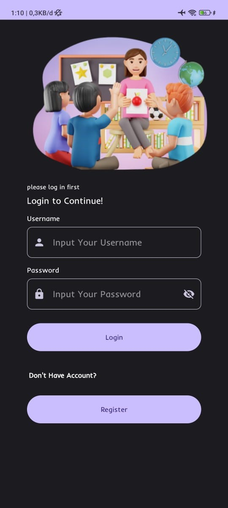
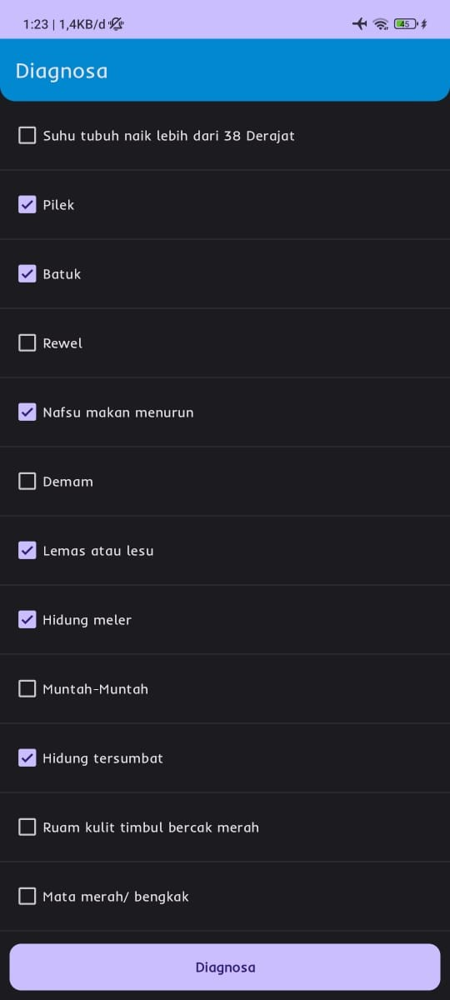
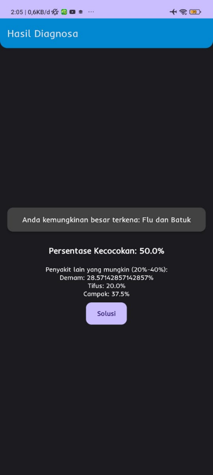

# E-Clinic Happy – Android Application

## Overview
**E-Clinic Happy** is an Android-based self-diagnosis application developed as a **Final Project (Tugas Akhir)**.  
The application is designed to assist parents in identifying early symptoms of common diseases in toddlers using a **rule-based Forward Chaining method**.

This project focuses on implementing a structured diagnosis flow on a mobile platform to support early awareness before consulting medical professionals.

---

## Project Scope
- Android mobile application
- Symptom-based self-diagnosis
- Rule-based inference using Forward Chaining
- Educational and early screening purposes

---

## My Role
**Android Developer**

Responsibilities:
- Developing Android UI and application flow
- Implementing diagnosis logic on the Android side
- Handling navigation, user interaction, and data presentation
- Integrating Android application with backend services

> This project was developed collaboratively. My contribution focused on **Android application development**.

---

## Key Features
- User authentication (Login)
- Symptom input for diagnosis
- Diagnosis result generation
- Disease information display
- User-friendly interface for parents

---

## Screenshots
Screenshots below were taken from the **final project documentation** during the development phase.  
Image quality is limited due to document export constraints.

| Login | Diagnosis | Diagnosis Result |
|------|----------|------------------|
|  |  |  |

---

## Technology Stack
- **Platform:** Android
- **Programming Language:** Kotlin
- **Architecture:** MVVM (basic implementation)
- **Diagnosis Method:** Forward Chaining
- **Backend:** Web-based Admin Dashboard (separate system)
- **Database:** Managed via backend (non-Firebase)

---

## Notes
- This repository contains **Android application source code only**.
- Backend (admin dashboard) is managed separately and is not included in this repository.
- This application is intended for **academic and educational purposes** and is not a medical diagnostic tool.

---

## Academic Context
This project was developed as part of the **Final Project (Tugas Akhir)** requirement.

---

## License
This project is intended for **portfolio and educational use only**.
